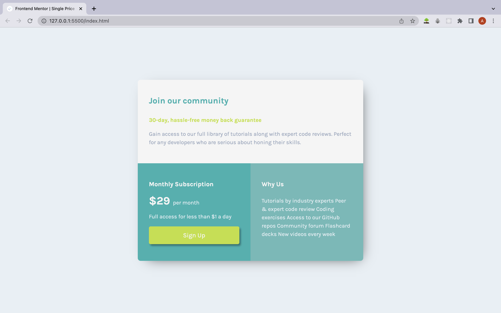
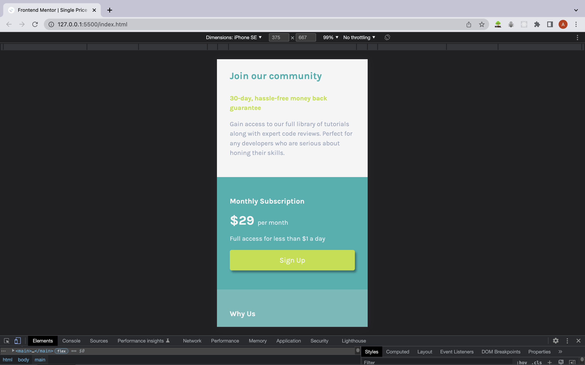

# Frontend Mentor - Single price grid component solution

This is a solution to the [Single price grid component challenge on Frontend Mentor](https://www.frontendmentor.io/challenges/single-price-grid-component-5ce41129d0ff452fec5abbbc). Frontend Mentor challenges help you improve your coding skills by building realistic projects. 

## Table of contents

- [Overview](#overview)
  - [The challenge](#the-challenge)
  - [Screenshot](#screenshot)
  - [Links](#links)
- [My process](#my-process)
  - [Built with](#built-with)
- [Author](#author)
- [Acknowledgments](#acknowledgments)

**Note: Delete this note and update the table of contents based on what sections you keep.**

## Overview

### The challenge

Users should be able to:

- View the optimal layout for the component depending on their device's screen size

### Screenshot

### Links

- Solution URL: [Github Link](https://github.com/Aayush895/Single-Price-Grid)
- Live Site URL: [Hosted Link](https://aayush895.github.io/Single-Price-Grid/)

## My process

### Built with

- Semantic HTML5 markup
- CSS custom properties
- Flexbox
- CSS Grid
- Mobile-first workflow

## Author

- Website - [Aayush Jha](https://www.linkedin.com/in/aayush-jha-6716b018b/)
- Frontend Mentor - [@Aayush895](https://www.frontendmentor.io/profile/Aayush895)
- Twitter - [@JhaAayush895](https://twitter.com/JhaAayush895)

## Acknowledgments

I would like to thank frontend-mentor for providing us with these type of challenges to test and improve our skill in the domain of frontend web development. 

